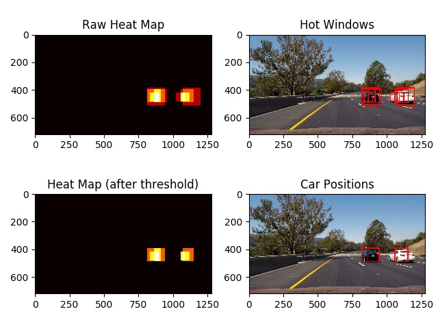

# Vehicle Detection Project

[](http://www.udacity.com/drive)

## Aim of this project
This project identifies the vehicles in photos or videos taken by a camera mounted on a car.


The final processed video can be viewed or downloaded via the [link](./output_videos/project_video_output.mp4).

## Outline of the approach

Our approach for detecting vehicles in an image contains the following steps:

1. Extract features from a labeled dataset to train a machine learning model to identify images with or without vehicles.

2. Pick up small windows inside the test image and test whether these windows have vehicles or not. Label the windows with vehicles as "hot windows".

3. Merge these hot windows and draw them on the images.


## Organization of the code

The code directory is organized as below:


- [```utils.py```](./utils.py): The core algorithms of feature extraction
- [```train_model.py```](./train_model): Training the linear SVM model.
- [```full_process.py```](./full_process.py): Processes of vehicle detection.
- [```render_video.py```](./render_video.py): Rendering the detection results to a new video.


## Train the classifier to identify vehicle/non-vehicle images.

I used ```Pipeline``` class of sci-kit learn to combine the feature extraction, feature normalization and linear SVM into one single class. The ```Pipeline``` instance contains three class to do this: 

(in ```train_model.py```)

```python
# Linear SVC classifier
svc_d = LinearSVC(C=0.1, tol=1e-3)

# Extracting color and HOG features
fe = FeatureExtractor(color_space='RGB', hog_channel='ALL', hog_color_space='YCrCb')

# Setup the pipeline
pip_comps = [('fext', fe), ('std', StandardScaler()), ('svc', svc_d)]
pip = Pipeline(pip_comps)

```

### Features in the image

I combined the color histograms and histogram of gradient (HOG) as the features to train the linear SVC.

The parameters of these feature extraction are set in the default parameters of ```FeatureExtractor``` class defined in ```utils.py```

```python

class FeatureExtractor(BaseEstimator, TransformerMixin):
    def __init__(self, color_space='RGB', hog_color_space='YCrCb', hog_channel="ALL", spatial_size=(32, 32),
                 hist_bins=32, hog_orient=9, hog_pix_per_cell=8, hog_cell_per_block=2, spatial_feat=True,
                 hist_feat=True, hog_feat=True):
        """
        
        :param color_space: color space for color and histogram features
        :param hog_channel: color channels used in HOG
        :param hog_color_space: integer (0-2) or string 'ALL'. Color space for HOG.
        :param spatial_size: tuple: (int,int). Resized image size for color features
        :param hist_bins: bins of color histogram
        :param hog_orient: orientations of HOG
        :param hog_pix_per_cell: pixels per block in HOG
        :param hog_cell_per_block: cells per block in HOG
        :param spatial_feat: whether including spatial color features
        :param hist_feat: whether including spatial features
        :param hog_feat: wheter including HOG feature
        """

```

For HOG features, I selected ```YCrCb``` as the color space for calculating the color gradients, because it performs better in identifying black cars against the road with black pavements. Using ```YCrCb``` color space also gives better overall accuracy on test dataset (~99%), compared to ~98% yielded by using ```RGB``` as the color space of calculating HOG. The ```FeatureExtractor``` yields 8460 features in total.


### Linear support vector machine classifier (Linear SVC)

I used the extracted features to train a linear SVC to classify vehicle/non-vehicle images. I tried to varied penalty (C) and tolerance (tot) but I found that the default parameters ```(C=1.0, tol=1e-4)``` perform reasonably well. I thus just used this to train the model. I took 20% of the training data as the test dataset. The accuracy on the test dataset is more than 99%.

I used the labled dataset of [vehicle](https://s3.amazonaws.com/udacity-sdc/Vehicle_Tracking/vehicles.zip) and [non-vehicle](https://s3.amazonaws.com/udacity-sdc/Vehicle_Tracking/non-vehicles.zip) prepared by Udacity, which are originally from a combination of the [GTI vehicle image database](http://www.gti.ssr.upm.es/data/Vehicle_database.html), the [KITTI vision benchmark suite](http://www.cvlibs.net/datasets/kitti/).

The final trained model is saved in ```final_clf.p```.


## Sliding window search

For each test image, I used small windows to slide through the images, feed each window images into the classifer. The full processes are wrapped in the class ```full_process.VehicleIdentifier```.

### Determining the range and sizes of the windows to search

I use the images provided in [test_images](./test_images) folder as well as some additional images extracted from the given project video to find the suitable search range and window sizes. 

The overlaps of the windows were decided empirically. In general, I gave larger window more overlap, but smaller window less overlaps. Details of the setting and examples are drawn in the follwing image:


### Rejecting false positives

I generated a heapmap of the windows that signals positive. I then applied some threshold to fitler out the parts in the heatmap with weaker "heat".

Here's an example of this process flow:




I then removed the boxes with very weired width/height ratio. This helps remove some false positive. I implemented this in ```full_process.draw_label_bboxes()```:


```python
def draw_labeled_bboxes(img, labels, ratio_bound=2.5):
    ....
        # Discard the resulting box if its shape is out of spec
        if ratio_bound is not None:
            bbox_width = np.max(nonzerox) - np.min(nonzerox)
            bbox_height = np.max(nonzeroy) - np.min(nonzeroy)
            long_edge = max(bbox_height, bbox_width)
            short_edge = min(bbox_height, bbox_width)
            if float(long_edge / short_edge) > ratio_bound:
                draw_box = False

    .....

```


## Processing the videos

To further reduce the false positives in the images and improve the smoothness of vehicle detection, I added up the heatmaps of subsequent frames in the video in order to improve accuracy of detection. My formula of doing this is:

_h'(t)=0.5*h(t)+0.5*(0.5*h(t-1)+0.3*h(t-1)+0.2*h(t-2))_

where _h(t)_ is the heatmap before appying threshold at time _t_


(in ```full_process.VehicleIdentifier.gen_heat_map()```)
```python
prev_heat = np.zeros_like(image[:, :, 0]).astype(np.float)
init_heat = np.copy(prev_heat)
# Add heat to each box in box list
raw_heat = add_heat(init_heat, hot_windows)

if self.add_past:
    if self.prev_heatmap:
        prev_heat += self.prev_heatmap[-1] * 0.5
        prev_heat += self.prev_heatmap[-2] * 0.3
        prev_heat += self.prev_heatmap[-3] * 0.2
    else:
        self.prev_heatmap = [np.copy(prev_heat) for i in range(self.max_heatmap_num)]

    all_heat = raw_heat * 0.5 + prev_heat * 0.5
else:
    all_heat = raw_heat
```

## Result

More processed images can be found in [output_images](./output_images) folder.
The processed video can be viewed or downloaded via the [link].(./output_videos/project_video_output.mp4)


## Discussion

The approach described above works reasonably well in most of the frames in the video, but occasionally it cannot identifies the vehicles properly (false negative) or wrongly identifies the landlines or fences as vehicles (false positive). Since a robust classifier is the cornerstone of making rubust vehicle identification, I think that further efforts should be invested in improving the image classifer, such as:

1. Including more data: Although the test accuracy of my classifer is >99%, it is very likely this is overfitted because the training dataset contains some time series data. Including other dataset such as [Udacity labeled dataset](https://github.com/udacity/self-driving-car/tree/master/annotations) may help improve the calssifer.

2. Trying out other machine learning models: it could be interesting to use convolutional neural network to implement the image classifer and see whether it gives better results.

3. Use ensemble methods: it could be interesting to mix the results of several different models to determine whether a window image is vehicle or non-vehicle. 


