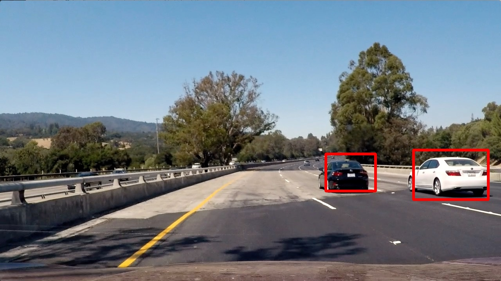

#Vehicle Detection Project

[](http://www.udacity.com/drive)

## Aim of this project
This project identifies the vehicles in photos or videos taken by a camera mounted on a car.



## Organization of the code

The code directory is organized as below:


- [```utils.py```](./utils.py): The core algorithms of feature extraction
- [```train_model.py```](./train_model): Training the LinearSVC model.
- [```full_process.py```](./full_process.py): Processes of vehicle detection.


## Train the classifier to identify vehicle/non-vehicle images.

I use ```Pipeline``` class of sci-kit learn to combine the feature extraction, feature normalization and linear SVC into one single class. The ```Pipeline``` instance contains three class to do this: 

(in ```train_model.py```)

```python
# Linear SVC classifier
svc_d = LinearSVC(C=0.1, tol=1e-3)

# Extracting color and HOG features
fe = FeatureExtractor(color_space='RGB', hog_channel='ALL', hog_color_space='YCrCb')

# Setup the pipeline
pip_comps = [('fext', fe), ('std', StandardScaler()), ('svc', svc_d)]
pip = Pipeline(pip_comps)

```

### Features in the image

I combine the color histograms and histogram of gradient (HOG) as the features to train the linear SVC.


