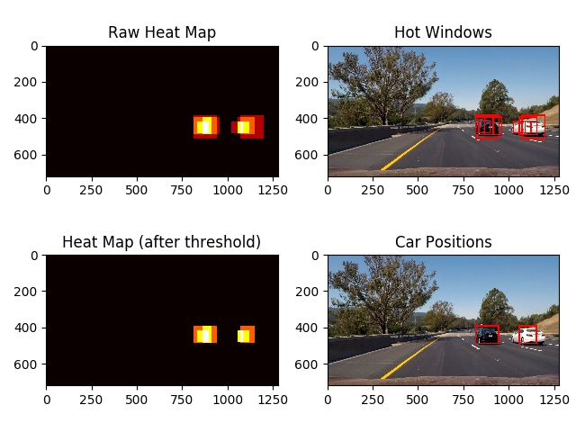

#Vehicle Detection Project

[](http://www.udacity.com/drive)

## Aim of this project
This project identifies the vehicles in photos or videos taken by a camera mounted on a car.


## Organization of the code

The code directory is organized as below:


- [```utils.py```](./utils.py): The core algorithms of feature extraction
- [```train_model.py```](./train_model): Training the LinearSVC model.
- [```full_process.py```](./full_process.py): Processes of vehicle detection.


## Train the classifier to identify vehicle/non-vehicle images.

I use ```Pipeline``` class of sci-kit learn to combine the feature extraction, feature normalization and linear SVC into one single class. The ```Pipeline``` instance contains three class to do this: 

(in ```train_model.py```)

```python
# Linear SVC classifier
svc_d = LinearSVC(C=0.1, tol=1e-3)

# Extracting color and HOG features
fe = FeatureExtractor(color_space='RGB', hog_channel='ALL', hog_color_space='YCrCb')

# Setup the pipeline
pip_comps = [('fext', fe), ('std', StandardScaler()), ('svc', svc_d)]
pip = Pipeline(pip_comps)

```

### Features in the image

I combine the color histograms and histogram of gradient (HOG) as the features to train the linear SVC.

The parameters of these feature extraction are set in the default parameters of ```FeatureExtractor``` class defined in ```utils.py```

```python

class FeatureExtractor(BaseEstimator, TransformerMixin):
    def __init__(self, color_space='RGB', hog_color_space='YCrCb', hog_channel="ALL", spatial_size=(32, 32),
                 hist_bins=32, hog_orient=9, hog_pix_per_cell=8, hog_cell_per_block=2, spatial_feat=True,
                 hist_feat=True, hog_feat=True):
        """
        
        :param color_space: color space for color and histogram features
        :param hog_channel: color channels used in HOG
        :param hog_color_space: integer (0-2) or string 'ALL'. Color space for HOG.
        :param spatial_size: tuple: (int,int). Resized image size for color features
        :param hist_bins: bins of color histogram
        :param hog_orient: orientations of HOG
        :param hog_pix_per_cell: pixels per block in HOG
        :param hog_cell_per_block: cells per block in HOG
        :param spatial_feat: whether including spatial color features
        :param hist_feat: whether including spatial features
        :param hog_feat: wheter including HOG feature
        """

```

For HOG features, I select ```YCrCb``` as the color space for calculating the color gradients, because it performs better in identifying black cars from the road with black pavements. Using ```YCrCb``` color space also gives better overall accuracy on test dataset (~99%), compared to ~98% yielded by using ```RGB``` as the color space of calculating HOG. The ```FeatureExtractor``` yields 8460 features in total.


### Linear SVC

I used ```GridSearchCV``` to find the best model.....


### The overall class

The final trained model is saved in ```final_clf.p```.


## Sliding window search

For each test image, I use small windows to slide through the images, feed each window images into the classifer. The full processes are wrapped in the class ```full_process.VehicleIdentifier```.

### Determining the range and sizes of the windows to search

I use the images provided in [test_images](./test_images) folder as well as some additional images extracted from the given project video to find the suitable search range and window sizes. 

The overlaps of the windows were decided empirically. In general, I give larger window more overlap, but smaller window less overlaps.


### Rejecting false positives

I generated a heapmap of the windows that signals positive. I then applying some threshold to filer out the parts in the heatmap with weaker "heat".


Here's an example of this process flow:



## Video Implmentation

The processed video can be found in [here](./output_videos/project_video_output.mp4).

To further reduce the false positives in the images and improve the smoothness of vehicle detection, I added up the heatmaps of subsequent frames in the video in order to improve accuracy of detection. My formula of doing this is:

_h'(t)=0.5*h(t)+0.5*(0.5*h(t-1)+0.3*h(t-1)+0.2*h(t-2))_

where _h(t)_ is the heatmap before appying threshold at time _t_


(in ```full_process.VehicleIdentifier.gen_heat_map()```)
```python
prev_heat = np.zeros_like(image[:, :, 0]).astype(np.float)
init_heat = np.copy(prev_heat)
# Add heat to each box in box list
raw_heat = add_heat(init_heat, hot_windows)

if self.add_past:
    if self.prev_heatmap:
        prev_heat += self.prev_heatmap[-1] * 0.5
        prev_heat += self.prev_heatmap[-2] * 0.3
        prev_heat += self.prev_heatmap[-3] * 0.2
    else:
        self.prev_heatmap = [np.copy(prev_heat) for i in range(self.max_heatmap_num)]

    all_heat = raw_heat * 0.5 + prev_heat * 0.5
else:
    all_heat = raw_heat
```


## Discussion

The approach described above works reasonably well in most of the frames in the video, but occasionally it cannot identifies the vehicles properly (false negative) or wrongly identifies the landlines or fences as vehicles (false positive).


